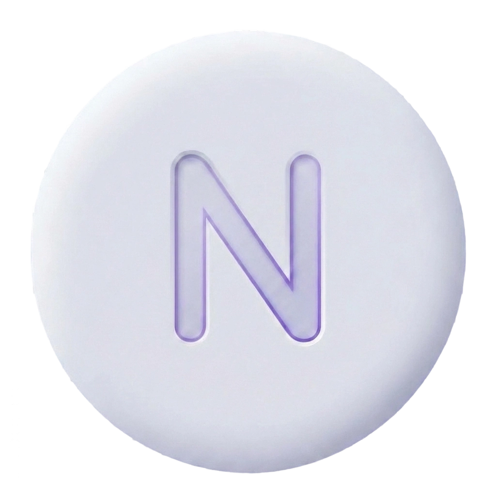

# NeuTab

<p align="center">
  
</p>

<p align="center">
  <strong>A beautiful neumorphic browser new tab extension</strong>
</p>

<p align="center">
  <a href="#features">Features</a> •
  <a href="#installation">Installation</a> •
  <a href="#development">Development</a> •
  <a href="#license">License</a>
</p>

<p align="center">
  <a href="#neutab-1">中文文档</a>
</p>

---

## Features

### 🎨 Immersive Visual Themes
- **Neumorphism** (Default): A soft, realistic UI design with subtle lighting and shadows that mimic physical objects.
- **Liquid Glass**: A premium aesthetic featuring frosted glass effects (Glassmorphism), vibrant gradients, and sci-fi breathing animations.
- **Theme Mode**: Support for **Light**, **Dark**, and **Auto** (system sync) modes.

### 🔍 Smart Search
- **Multi-Engine Support**: Built-in Google, Bing, and GitHub engines.
- **Custom Engines**: Add your own search engines with custom URL templates.
- **Smart Suggestions**: Real-time search suggestions from your **Bookmarks** and **Browsing History**.
- **Privacy First**: All suggestions are processed locally.

### 🚀 Quick Launch
- **Group Management**: Organize your favorite sites into custom groups.
- **Drag & Drop**: Intuitive sorting for both apps and groups (powered by @dnd-kit).
- **Smart Icon System**:
  1. **Vector Icons**: 150+ high-quality SVGs for popular sites.
  2. **Letter Avatars**: Auto-generated gradient avatars for unmapped sites.
  3. **Favicons**: Automatic fetching of high-res favicons as a fallback.
- **Auto-Categories**: Optional "Frequently Visited" and "Recent History" groups.

### ⚙️ Personalization & Data
- **Layout Control**: Fully customizable container width, padding, card size, and corner radius.
- **Cloud Sync**: Seamless cross-device synchronization using Chrome Sync (with chunked storage support to bypass the 8KB limit).
- **Backup & Restore**: Export your full configuration (including custom icons) to JSON and restore it anytime.
- **Offline First**: Zero-latency rendering with synchronous local caching to prevent FOUC (Flash of Unstyled Content).

---

## Installation

### From Web Store
*(Pending launch)*

### Manual Installation (Chrome / Edge / Brave)

1. **Download**: Clone this repository or download the latest release.
2. **Install Dependencies**:
   ```bash
   pnpm install
   ```
3. **Build**:
   ```bash
   pnpm build
   ```
4. **Load Extension**:
   - Open `chrome://extensions/`
   - Enable **Developer mode** (top right).
   - Click **Load unpacked**.
   - Select the `build/chrome-mv3-prod` folder.

### Manual Installation (Firefox)

Firefox does not support loading unpacked extensions permanently during development.

1. **Build for Firefox**:
   ```bash
   pnpm build:firefox
   ```
2. **Temporary Load**:
   - Open `about:debugging#/runtime/this-firefox`
   - Click **Load Temporary Add-on...**
   - Select `build/firefox-mv3-prod/manifest.json`.

---

## Development

### Prerequisites
- Node.js 18+
- pnpm (recommended)

### Setup

```bash
# Install dependencies
pnpm install

# Start development server (HMR supported)
pnpm dev

# Build for production
pnpm build

# Package for distribution (zip)
pnpm package
```

### Firefox Development
Plasmo supports specific targets for cross-browser compatibility.

```bash
# Dev for Firefox
pnpm dev:firefox

# Build for Firefox
pnpm build:firefox
```

### Project Structure
```
NeuTab/
├── components/
│   ├── header/             # Clock & Greetings
│   ├── quick-launch/       # App grids, Groups, Drag & Drop logic
│   ├── search/             # Search bar, Engines, Suggestions
│   ├── settings/           # Settings panel, Layout preview
│   └── common/             # Shared UI components
├── assets/                 # Static assets & Icons
├── bootstrap/              # Theme restoration & Storage sync
├── pages/                  # Extension pages (NewTab)
├── styles/                 # Global CSS & Theme definitions
│   └── themes/             # Specific theme styles (e.g., liquid-glass.css)
└── utils/                  # Helpers (Storage, I18n, Favicons)
```

---

## License

[MIT](LICENSE)

---

---

# NeuTab

<p align="center">
  <strong>精美的 NeuTab 新拟态浏览器主页扩展</strong>
</p>

<p align="center">
  <a href="#功能特性">功能特性</a> •
  <a href="#安装方法">安装方法</a> •
  <a href="#开发指南">开发指南</a> •
  <a href="#许可证">许可证</a>
</p>

---

## 功能特性

### 🎨 沉浸式视觉主题
- **新拟态 (Neumorphism)**：默认风格，提供柔和、逼真的光影质感，还原物理按键触感。
- **流体玻璃 (Liquid Glass)**：高级磨砂玻璃特效（Glassmorphism），配合细腻的流光渐变与呼吸动效，科技感十足。
- **主题模式**：完美支持 **浅色**、**深色** 及 **跟随系统 (Auto)** 切换。

### 🔍 智能搜索
- **多引擎支持**：内置 Google、Bing、GitHub 搜索。
- **自定义引擎**：支持添加任意自定义搜索引擎（支持 URL 模板）。
- **智能建议**：实时匹配您的 **浏览器书签** 和 **历史记录**，无需离开新标签页即可快速跳转。
- **隐私保护**：所有建议均在本地处理，不上传任何数据。

### 🚀 快速启动 (Quick Launch)
- **分组管理**：创建自定义分组来整理您的常用网站。
- **拖拽排序**：支持图标与分组的自由拖动排序（基于 @dnd-kit）。
- **智能图标系统**：
  1. **矢量图标**：内置 150+ 热门网站的高清 SVG 图标。
  2. **字母头像**：为未收录网站自动生成美观的渐变字母头像。
  3. **Favicon**：自动抓取网站高清 Favicon 作为补充。
- **动态分类**：可选开启“常去网站”和“最近访问”自动分组。

### ⚙️ 个性化与数据
- **布局定制**：全方位调整页面最大宽度、边距、卡片尺寸及圆角大小。
- **云端同步**：利用 Chrome Sync 实现跨设备配置同步（采用分片存储技术，突破原生 8KB 限制）。
- **备份还原**：支持将所有配置（含自定义图标数据）导出为 JSON 文件，随时恢复。
- **零延迟渲染**：采用同步缓存机制，彻底根除新标签页加载时的闪屏 (FOUC) 问题。

---

## 安装方法

### 从插件商店
*（待上线）*

### 手动安装 (Chrome / Edge / Brave)

1. **下载**：克隆本仓库或下载最新 Release 包。
2. **安装依赖**：
   ```bash
   pnpm install
   ```
3. **构建**：
   ```bash
   pnpm build
   ```
4. **加载扩展**：
   - 打开浏览器扩展管理页 `chrome://extensions/`
   - 开启右上角的 **开发者模式**。
   - 点击 **加载已解压的扩展程序**。
   - 选择 `build/chrome-mv3-prod` 目录。

### 手动安装 (Firefox)

Firefox 在开发模式下不支持永久加载未签名的已解压扩展。

1. **构建 Firefox 版本**：
   ```bash
   pnpm build:firefox
   ```
2. **临时加载**：
   - 打开 `about:debugging#/runtime/this-firefox`
   - 点击 **临时载入附加组件...**
   - 选择 `build/firefox-mv3-prod/manifest.json` 文件。

---

## 开发指南

### 环境要求
- Node.js 18+
- pnpm (推荐)

### 快速开始

```bash
# 安装项目依赖
pnpm install

# 启动开发服务器 (支持热更新)
pnpm dev

# 构建生产版本
pnpm build

# 打包发布 (生成 zip)
pnpm package
```

### Firefox 开发
Plasmo 提供了针对不同浏览器的构建目标。

```bash
# Firefox 开发模式
pnpm dev:firefox

# Firefox 生产构建
pnpm build:firefox
```

### 项目结构
```
NeuTab/
├── components/
│   ├── header/             # 顶部时钟与问候
│   ├── quick-launch/       # 快捷启动网格、分组、拖拽逻辑
│   ├── search/             # 搜索框、引擎管理、联想建议
│   ├── settings/           # 设置面板、实时布局预览
│   └── common/             # 通用 UI 组件
├── assets/                 # 静态资源与构建补丁
├── bootstrap/              # 主题恢复与存储同步脚本
├── pages/                  # 扩展页面入口 (NewTab)
├── styles/                 # 全局样式与主题定义
│   └── themes/             # 特定主题样式 (如 liquid-glass.css)
└── utils/                  # 工具库 (存储封装、多语言、Favicon)
```

---

## 许可证

[MIT](LICENSE)
